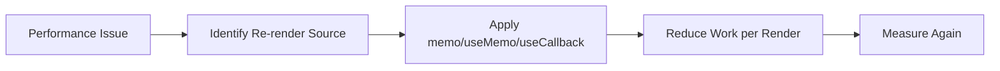

# Optimization - Detailed Hinglish Notes

## Is Folder me Kya Hua Hai?
- Is folder me `Optimization` topic ko step-by-step practical code ke through implement kiya gaya hai.
- Main goal: concept samajhna + uska practical implementation dekhna.

## Important Files (Yahi Dekho Pehle)
- `src/App.jsx`
- `src/ProductList.jsx`
- `src/main.jsx`

## Concept Kya Hai? (Simple Hinglish Explanation)
- **Performance Optimization:** App ko fast rakhne ke liye rendering aur data flow optimize karte hain.
- **Memoization:** `React.memo`, `useMemo`, `useCallback` se targeted optimization hota hai.

## Diagram (Optimization Strategy)

## Code Flow Samjho (Step-by-Step)
- Component render hota hai aur initial state/props set hoti hain.
- User interaction ya lifecycle/event trigger se logic run hota hai.
- State/data update hota hai, phir React updated UI render karta hai.
- Isi flow ko samajh ke tum same concept kisi naye project me laga sakte ho.

## Real-World Use
- Ye concept production apps me readability, maintainability, aur performance improve karne ke liye use hota hai.
- Interview me mostly ye puchte hain: "kab use karoge, kyu use karoge, aur alternative kya hai?"
