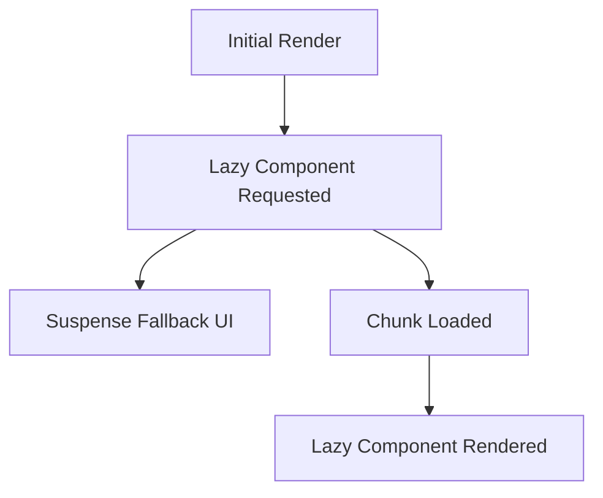

# Lazy Loading - Detailed Hinglish Notes

## Is Folder me Kya Hua Hai?
- Is folder me lazy loading ka real use-case banaya gaya hai jisme component demand par load hota hai aur fallback UI dikhayi jaati hai.
- Main goal: concept samajhna + uska practical implementation dekhna.

## Important Files (Yahi Dekho Pehle)
- `src/App.jsx`
- `src/components/Courses.jsx`
- `src/components/FAQ.jsx`
- `src/components/Footer.jsx`
- `src/components/Hero.jsx`
- `src/components/Navbar.jsx`

## Concept Kya Hai? (Simple Hinglish Explanation)
- **React.lazy:** `React.lazy` se component ko demand par load karte hain, initial bundle size kam hota hai.
- **Suspense:** `Suspense` lazy component load hone tak fallback UI (loader/text) show karta hai.
- **Code Splitting:** App code chunks me split hota hai jisse first load performance improve hoti hai.

## Diagram (React.lazy + Suspense)

## Code Flow Samjho (Step-by-Step)
- Component render hota hai aur initial state/props set hoti hain.
- User interaction ya lifecycle/event trigger se logic run hota hai.
- State/data update hota hai, phir React updated UI render karta hai.
- Isi flow ko samajh ke tum same concept kisi naye project me laga sakte ho.

## Real-World Use
- Ye concept production apps me readability, maintainability, aur performance improve karne ke liye use hota hai.
- Interview me mostly ye puchte hain: "kab use karoge, kyu use karoge, aur alternative kya hai?"
