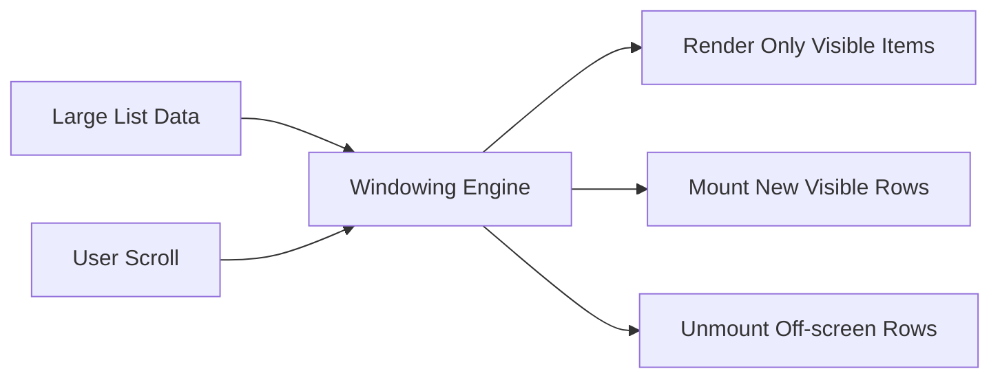

# React Virtualization - Detailed Hinglish Notes

## Is Folder me Kya Hua Hai?
- Is folder me large list rendering optimization pe focus hai jahan virtualization/windowing se app fast rakha jata hai.
- Main goal: concept samajhna + uska practical implementation dekhna.

## Important Files (Yahi Dekho Pehle)
- `src/App.jsx`
- `src/Virtualisation.jsx`
- `src/Virtuoso.jsx`
- `src/main.jsx`

## Concept Kya Hai? (Simple Hinglish Explanation)
- **React Virtualization:** Large list ka sirf visible part render karke performance improve karte hain.
- **Windowing:** Pure list render nahi hoti; viewport ke hisaab se items mount/unmount hote hain.
- **Performance at Scale:** Thousands items ke case me memory aur rendering cost bahut kam ho jati hai.

## Diagram (Virtualization/Windowing)

## Code Flow Samjho (Step-by-Step)
- Component render hota hai aur initial state/props set hoti hain.
- User interaction ya lifecycle/event trigger se logic run hota hai.
- State/data update hota hai, phir React updated UI render karta hai.
- Isi flow ko samajh ke tum same concept kisi naye project me laga sakte ho.

## Real-World Use
- Ye concept production apps me readability, maintainability, aur performance improve karne ke liye use hota hai.
- Interview me mostly ye puchte hain: "kab use karoge, kyu use karoge, aur alternative kya hai?"
